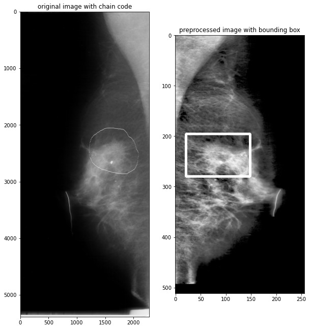

# Mammogram Preprocessing

This project preprocesses mammogram images by cropping, removing text, enhancing contrast, and adjusting chaincodes to highlight abnormalities.

## Features
- Crop black borders and non-breast regions.
- Remove text artifacts using morphological operations.
- Enhance contrast with single or double CLAHE.
- Adjust and mirror chaincodes based on breast orientation.
- Visualize preprocessing steps and results.

## Installation
1. Clone the repository:
   ```bash
   git clone https://github.com/AmirFeiz2001/Mammogram_Preprocessing.git
   cd Mammogram_Preprocessing

## Adding BoundingBox

